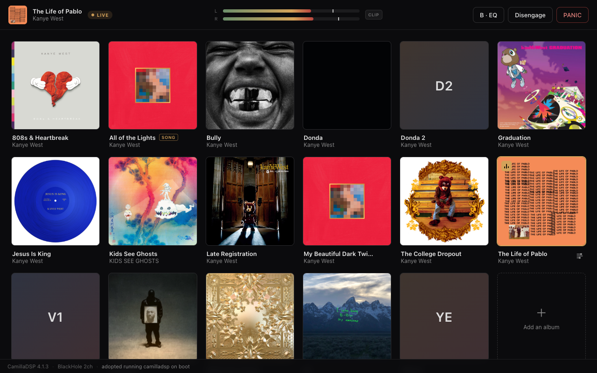

<div align="center">

# 🎚️ ToneDeck

### Studio-grade EQ for your headphones — without touching a single number.

**Per-album, per-song parametric EQ for macOS that you control by *talking*.**
Pick a record, and your system audio routes through a real DSP engine tuned to *that album's* production. Hear something off? Just say *"this is harsh"* or *"vocals are buried"* — and watch it fix itself, live, with no clicks and no gaps.

<br />



<br />

*A control plane for [CamillaDSP](https://github.com/HEnquist/camilladsp), wrapped in an interface that feels like your favorite music app — and a brain that speaks your language.*

</div>

---

## Why ToneDeck exists

Every pair of headphones colors the sound. Every album was mixed differently. The fix — parametric EQ — has existed for decades, but the tools are hostile: cryptic band tables, Q factors, dB-per-octave, and a real risk of blowing out your ears if you get it wrong.

So almost nobody does it. People live with bass that's too loud on one record and vocals that vanish on the next.

**ToneDeck makes per-album EQ feel effortless.** Browse your library like a streaming app. Click an album to go live. Nudge five plain-English sliders, or just *describe what's wrong* and let Claude design the curve from real production knowledge. The DSP swaps presets seamlessly between songs, the engine refuses to clip your ears, and a panic button always gives you your audio back.

---

## ✨ What you get

### 🗣️ Tune by talking — not by guessing
Describe the sound, get the fix. *"Tune Madvillainy for my headphones"* → Claude reads the album's production character and designs a preset. *"Too much bass"* / *"add some air"* → small, reasoned band moves, logged with your own words as the change history. *"Undo that"* / *"back to the original"* → one-word revert. No DSP vocabulary required, ever.

### 🎛️ Five sliders that actually make sense
**Warmth · Punch · Clarity · Smoothness · Sparkle.** Plain-language taste maps straight onto the underlying biquad filters, with a live preview while you drag. You hear the change before you commit it.

### 💿 Per-album *and* per-song
EQ isn't one-size-fits-all and neither is ToneDeck. Tune a whole album, then carve out individual tracks as deltas off the album curve. Your library, your taste, remembered per record.

### ⚡ Glitch-free live switching
Presets hot-swap over the CamillaDSP websocket — the DSP process **never restarts** between albums (verified PID-stable). No pops, no dropouts, no silence. It just changes.

### 🎨 An interface that earns its place next to your music app
A warm, album-art-forward UI: **Your Library** sidebar, a live EQ frequency-response curve, a real-time level visualizer, L/R meters with a clip light, and **A/B bypass** so you can hear the EQ against flat instantly. Album art loads automatically and *self-heals* — new presets fetch their cover on first view and cache it forever.

### 🤖 Auto-EQ that follows along
Arm Auto-EQ and ToneDeck follows what's playing in Apple Music, tuning each new song as it starts — and politely yielding the moment you take manual control.

### 🔊 Optimize for loudness
One click re-balances the whole curve for a target preamp via Claude, so you can chase loudness without clipping.

### 🛡️ Safety built into the engine, not bolted on
Per-headphone gain clamps. Predicted-headroom auto-trim against clipping. `camilladsp --check` before *every* apply. Watchdogs that self-heal when macOS steals your output device or the DSP dies. And a **panic path that works even if the daemon is dead** — your ears come first.

### ↩️ Versioned, with nothing ever lost
Every save snapshots the previous version. `revert` undoes the last change; `--original` restores factory values. Experiment freely.

---

## 🚀 Get started

**Requirements** — macOS (Apple Silicon or Intel) and a few audio building blocks:

```sh
brew install blackhole-2ch      # virtual loopback device (routes system audio in)
brew install camilladsp         # the DSP engine (built on 4.x)
brew install switchaudio-osx    # output-device switching
# Node.js ≥ 22
```

**Install** — one script wires up everything:

```sh
git clone https://github.com/AvyanshKatiyar/tonedeck && cd tonedeck
./scripts/install.sh     # builds, installs the CLI + panic script, generates the
                         # LaunchAgent for this machine, registers the Claude skill,
                         # and drops a ToneDeck.app launcher on your Desktop
open http://127.0.0.1:5055
```

The installer also puts a double-clickable **`ToneDeck.app`** on your Desktop: it makes sure the daemon is up, then opens the UI in a clean app-mode window. Drag it to the Dock or Applications if you like. Skip it with `./scripts/install.sh --no-launcher`, or (re)build it anytime with `./scripts/make-launcher.sh`. The top bar carries a **live/standby/offline** status pill so you can see at a glance whether the daemon and CamillaDSP engine are running.

Click an album → ToneDeck routes system audio through BlackHole into CamillaDSP and out to your headphones. **Engage/Disengage** controls whether ToneDeck owns audio at all; **panic** (UI button or `tonedeck-panic` in any terminal) always hands audio back to a real device. `./scripts/uninstall.sh` reverses everything but keeps your presets.

> The bundled headphone profile targets the **FiiO FT1 Pro** (`profiles/ft1pro.json`). For other headphones, copy it, adjust the band template / limits / device name, and point your presets' `profile` field at it.

---

## 🗣️ Talk to it

With [Claude Code](https://claude.com/claude-code) installed, the tuning skill is registered automatically by the installer:

> *"tune Madvillainy for my headphones"* → Claude designs a preset from the album's production character, applies it, verifies it, and asks how it sounds.
>
> *"vocals are buried"* / *"too much bass"* → small, reasoned band moves, logged with your words.
>
> *"undo that"* / *"back to the original"* → built-in revert.

The skill ships a complete tuning methodology — a band guide, a symptom→band map, and worked examples — so Claude tunes from real production knowledge instead of guessing.

---

## ⌨️ Or drive it from the terminal

| Command | What it does |
|---|---|
| `tonedeck status` / `doctor` | State of the chain / full healthcheck |
| `tonedeck list` / `show <slug>` | Browse presets |
| `tonedeck on [slug]` / `off` / `panic` | Engage / disengage / emergency stop |
| `tonedeck apply <slug>` | Switch preset (glitch-free) |
| `tonedeck bypass on\|off` | A/B against flat |
| `tonedeck tweak <slug> --vibe warmth=1` | Vibe- or `--band`-level adjustments |
| `tonedeck revert <slug> [--original\|--to N]` | Undo / restore any version |
| `tonedeck create --from-json -` | New preset from stdin JSON |
| `tonedeck meters --watch` | Live RMS/peak/clip readout |

Every verb takes `--json` (machine output, stable exit codes) — the CLI is the contract the Claude skill drives, and the seam a future MCP server will wrap.

---

## 🔧 How it works

```
Mac audio → BlackHole 2ch → CamillaDSP (biquad EQ) → your headphones
                               ↑ websocket (SetConfig, meters, clip counters)
                            daemon (Fastify, :5055) ← UI / CLI / Claude skill
```

Presets are canonical JSON (`presets/builtin/`, user copies in `~/.tonedeck/presets/`); the CamillaDSP YAML is a generated artifact. The devices block is **byte-identical across presets by construction** — that's what makes hot-swapping seamless. The daemon is a pure control plane: it can restart freely without killing audio, and re-adopts a running DSP on boot. Album artwork is resolved from iTunes, cached locally, and persisted back to the preset so covers survive cache clears.

---

## 🧪 Development

```sh
npm install && npm run build && npm test   # 300+ tests, no audio hardware needed
npm run typecheck
npm run dev:daemon                          # daemon in watch mode
npm run smoke:control                       # live end-to-end battery (needs camilladsp)
npm run smoke:skill                         # validates every CLI command in the skill docs
npm run smoke:panic                         # panic-script logic, fully shimmed
```

Monorepo: `packages/shared` (schema, RBJ biquad math, safety, YAML emitter) · `packages/daemon` · `packages/cli` · `packages/ui` (Vite + React) · `skill/tonedeck-eq`.

If audio ever sounds wrong: [RECOVERY.md](RECOVERY.md).

---

<div align="center">

**ToneDeck** — your headphones, finally tuned to the music.

[MIT](LICENSE)

</div>
